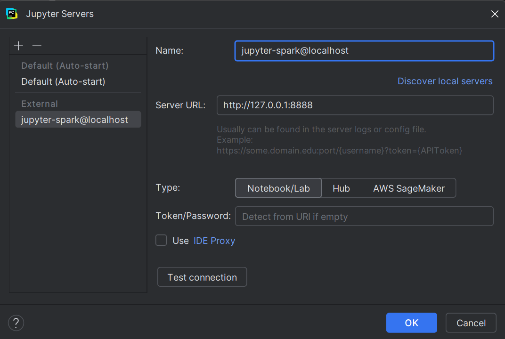

# Jupyter + Spark

## Описание
Прокидывает в контейнер текущую директорию, в которой находится сам Dockerfile, и все, что в ней находится. Таким образом, можно сложить в директорию рядом датасеты и обращаться к ним из Jupyter Notebook

## Как запустить
Построить Docker-образ. Из директории, в которой лежит Dockerfile, выполнить следующую команду:
```bash
docker build -t custom-jupyter-spark:latest .
```

И запустить контейнер с открытым портом для Jupyter Notebook
```bash
docker run -it --rm -p 8888:8888 -v ${PWD}:/home/jovyan/work custom-jupyter-spark:latest
```

Остановить контейнер можно 
1. Выполнить команду
```bash
docker stop custom-jupyter-spark
```
2. Завершение сессии: Закрыть терминал или нажать Ctrl+D (или exit) в интерактивной сессии Docker, чтобы завершить процесс.
3. Автостоп: Поскольку используется опция --rm, контейнер автоматически остановится и удалится после закрытия сессии.

Чтобы посмотреть логи контейнера, нужно выполнить команду
```bash
docker logs custom-jupyter-spark
```

## Подключение к Jupyter Notebook

После запуска контейнера в логах контейнера можно увидеть ссылку на Jupyter Notebook (http://localhost:8888). Для использования с IDE сконфигурировать external server в настройках IDE, используя указанную ссылку.

Пример настройки для PyCharm:
